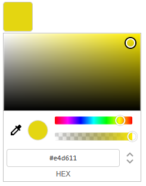
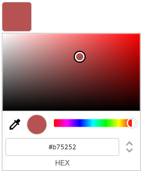

# Google Chrome Style Color Picker (hcg-color-picker)

A lightweight, dependency-free color picker widget inspired by Google Chrome's built-in color picker. Supports multiple instances, alpha control, touch input, and the EyeDropper API.

- **Website:** [html-code-generator.com/javascript/chrome-style-color-picker](https://www.html-code-generator.com/javascript/chrome-style-color-picker)

- **npm:** [npmjs.com/package/hcg-color-picker](https://www.npmjs.com/package/hcg-color-picker)

Full docs and live demos: [website](https://www.html-code-generator.com/javascript/chrome-style-color-picker)

---

## Preview




---

## Features

- **No dependencies** - pure vanilla JavaScript, no libraries required
- **Multiple instances** - attach a picker to any number of buttons, each remembers its own color
- **Single shared UI** - one picker element is reused across all instances, keeping memory usage minimal
- **Three color modes** - switch between HEX, RGBA, and HSLA input formats
- **Alpha / opacity control** - full transparency support, can be enabled or disabled per instance
- **EyeDropper API** - pick any color from the screen (supported browsers only)
- **Touch support** - works on mobile and tablet devices
- **Color preview swatch** - live preview inside the picker
- **Keyboard accessible** - color text inputs are fully keyboard navigable
- **`data-color` attribute** - current color is always available on the trigger element via `element.dataset.color`
- **Event system** - subscribe and unsubscribe to color change events
- **Programmatic API** - set color, open/close, enable/disable, and destroy instances at runtime
- **Destroy by element** - `hcgColor.get()`, `hcgColor.destroy()`, and `hcgColor.destroyAll()` without keeping an instance reference
- **`open` / `close` events** - listen for when the picker is shown or hidden
- **Debounce option** - built-in change event throttling for expensive handlers

---

## Installation

### Download

```html
<link rel="stylesheet" href="hcg-color.css">
<script src="hcg-color.js"></script>
```

Minified builds are available in [`dist/hcg-color.min.js`](dist/hcg-color.min.js) and [`dist/hcg-color.min.css`](dist/hcg-color.min.css).

### CDN

**jsDelivr:**

```html
<link rel="stylesheet" href="https://cdn.jsdelivr.net/npm/hcg-color-picker@2.0.5/hcg-color.css">
<script src="https://cdn.jsdelivr.net/npm/hcg-color-picker@2.0.5/hcg-color.js"></script>
```

**unpkg:**

```html
<link rel="stylesheet" href="https://unpkg.com/hcg-color-picker@2.0.5/hcg-color.css">
<script src="https://unpkg.com/hcg-color-picker@2.0.5/hcg-color.js"></script>
```

After the script loads, `hcgColor` is available as a global variable.

### npm

```bash
npm install hcg-color-picker
```

```js
import hcgColor from 'hcg-color-picker';
import 'hcg-color-picker/hcg-color.css';
```

---

## Basic Usage

```html
<button id="my-color-btn">Pick Color</button>

<script>
    const picker = new hcgColor(
        document.getElementById('my-color-btn'),
        { color: '#ff0000' }
    );

    picker.on('change', function (colors, source) {
        console.log(colors.hex);   // "#ff0000"
        console.log(source);       // "drag" | "input" | "api" | "eyedropper"
    });
</script>
```

---

## Constructor

```js
new hcgColor(element, options)
```

| Parameter | Type          | Required | Description                |
|-----------|---------------|----------|----------------------------|
| `element` | `HTMLElement` | Yes      | The trigger button element |
| `options` | `object`      | No       | Configuration (see below)  |

---

## Options

| Option     | Type       | Default     | Description                                         |
|------------|------------|-------------|-----------------------------------------------------|
| `color`    | `string`   | `data-color` attr or `'#ff0000'` | Initial color - HEX, RGB, HSL formats |
| `onChange` | `function` | -           | Shorthand change callback (same as `.on('change')`) |
| `onOpen`   | `function` | -           | Shorthand open callback (same as `.on('open')`)     |
| `onClose`  | `function` | -           | Shorthand close callback (same as `.on('close')`)   |
| `alpha`    | `boolean`  | `true`      | Set to `false` to disable alpha control             |
| `debounce` | `number`   | `0`         | ms to debounce the change event during drag (0 = off) |
| `disabled` | `boolean`  | `false`     | Start in disabled state - also reads `element.disabled` |

```js
const picker = new hcgColor(btn, {
    color:    '#ff0000',
    onChange: colors => console.log(colors.hex),
    alpha:    true,
    debounce: 150,
    disabled: false
});
```

---

## Initial Color Formats

The `color` option accepts any of the following formats:

```js
new hcgColor(el, { color: '#ff0000' });               // 6-digit HEX
new hcgColor(el, { color: '#ff0000ff' });              // 8-digit HEX with alpha
new hcgColor(el, { color: '#f00' });                   // 3-digit HEX shorthand
new hcgColor(el, { color: '#f00a' });                  // 4-digit HEX shorthand with alpha
new hcgColor(el, { color: 'rgb(255, 0, 0)' });         // RGB
new hcgColor(el, { color: 'rgba(255, 0, 0, 0.5)' });   // RGBA
new hcgColor(el, { color: 'hsl(0, 100%, 50%)' });      // HSL
new hcgColor(el, { color: 'hsla(0, 100%, 50%, 1)' });  // HSLA
```

---

## Instance Methods

### `.on(event, callback)`
Subscribe to an event.
```js
picker.on('change', function (colors, source) {
    console.log(colors.hex);   // "#ff0000"
    console.log(colors.rgb);   // "rgb(255, 0, 0)"
    console.log(colors.rgba);  // "rgba(255, 0, 0, 1)"
    console.log(colors.hsl);   // "hsl(0, 100%, 50%)"
    console.log(colors.hsla);  // "hsla(0, 100%, 50%, 1)"
    console.log(source);       // "drag" | "input" | "api" | "eyedropper"
});
```

### `.off(event, callback)`
Unsubscribe a specific listener.
```js
function onChange(colors) { console.log(colors.hex); }

picker.on('change', onChange);
picker.off('change', onChange);
```

### `.setColor(color)`
Programmatically set the color. Fires the `change` event.
```js
picker.setColor('#00ff00');
picker.setColor('rgb(0, 255, 0)');
```

### `.getColor()`
Returns the current color as an object with all formats:

```js
picker.getColor();
// {
//     hex:  "#ff0000",
//     hexa: "#ff0000ff",
//     rgb:  "rgb(255, 0, 0)",
//     rgba: "rgba(255, 0, 0, 1)",
//     hsl:  "hsl(0, 100%, 50%)",
//     hsla: "hsla(0, 100%, 50%, 1)"
// }

picker.getColor().hex   // "#ff0000"
picker.getColor().rgba  // "rgba(255, 0, 0, 1)"
picker.getColor().hsla  // "hsla(0, 100%, 50%, 1)"
```

### `.setAlphaEnabled(boolean)`
Enable or disable the alpha slider at runtime.
```js
picker.setAlphaEnabled(false); // hide alpha controls
picker.setAlphaEnabled(true);  // show alpha controls
```

### `.open()` / `.close()`
Programmatically open or close the picker.
```js
picker.open();
picker.close();

if (picker.isOpen) {
    picker.close();
}
```

### `.disable()` / `.enable()`
Disable or re-enable the picker.
```js
picker.disable();
picker.enable();
```

### `.destroy()`
Fully remove the picker instance - cleans up event listeners, clears state, and removes the color from the element.
```js
picker.destroy();
```

---

## Static Methods

Look up or destroy a picker by trigger element without keeping the instance returned from `new hcgColor()`. Each trigger stores its instance on `element._hcgColor`.

### `hcgColor.get(element | selector)`
Returns the picker instance for a trigger element, or `null`.

```js
const picker = hcgColor.get('#my-btn');
if (picker) {
    picker.setColor('#00ff00');
}
```

### `hcgColor.destroy(element | selector)`
Destroy a picker by element or CSS selector. Returns `true` if an instance was found and destroyed, otherwise `false`.

```js
new hcgColor(document.getElementById('my-btn'), { color: '#ff0000' });

// later, no saved reference needed
hcgColor.destroy('#my-btn'); // true
```

### `hcgColor.destroyAll()`
Destroy every active picker instance.

```js
hcgColor.destroyAll();
```

---

## Events

| Event    | Callback args    | Description                        |
|----------|------------------|------------------------------------|
| `change` | `colors, source` | Fired every time the color changes |
| `open`   | `hex`            | Fired when the picker opens        |
| `close`  | `hex`            | Fired when the picker closes       |

```js
picker.on('open',  hex => console.log('opened with:', hex));
picker.on('close', hex => console.log('closed with:', hex));
```

### `colors` object

```js
{
    hex:  "#ff0000",
    hexa: "#ff0000ff",
    rgb:  "rgb(255, 0, 0)",
    rgba: "rgba(255, 0, 0, 1)",
    hsl:  "hsl(0, 100%, 50%)",
    hsla: "hsla(0, 100%, 50%, 1)"
}
```

### `source` string

| Value          | Triggered by                              |
|----------------|-------------------------------------------|
| `"drag"`       | Dragging the color box, hue, or alpha slider |
| `"input"`      | Typing into HEX, RGBA, or HSLA inputs     |
| `"api"`        | Calling `.setColor()` programmatically    |
| `"eyedropper"` | Picking a color with the EyeDropper API   |

---

## Multiple Instances

Each instance is independent - they share one picker UI but each stores its own color state.

```js
const picker1 = new hcgColor(document.getElementById('btn1'), { color: '#ff0000' });
const picker2 = new hcgColor(document.getElementById('btn2'), { color: '#0000ff' });
const picker3 = new hcgColor(document.getElementById('btn3'), { color: '#00ff00', alpha: false });

picker1.on('change', colors => console.log('Picker 1:', colors.hex));
picker2.on('change', colors => console.log('Picker 2:', colors.hex));
```

---

## Reading Color Without an Instance Reference

The current color is always stored on the trigger element via `data-color`:

```js
document.querySelectorAll('.color-btn').forEach(btn => {
    console.log(btn.dataset.color); // "#ff0000"
});
```

To destroy without saving the instance:

```js
hcgColor.destroy('.color-btn');
```

---

## Usage in React

A dedicated React component is available as a separate package.

```bash
npm install hcg-color-picker-react
```

```jsx
import ColorPicker from 'hcg-color-picker-react';
import 'hcg-color-picker-react/ColorPicker.css';

function App() {
    return (
        <ColorPicker
            color="#ff0000"
            onChange={(colors, source) => console.log(colors.hex, source)}
        />
    );
}
```

Full documentation: [hcg-color-picker-react on npm](https://www.npmjs.com/package/hcg-color-picker-react)

---

## Browser Support

| Feature         | Support                                   |
|-----------------|-------------------------------------------|
| Color picker UI | All modern browsers                       |
| Touch events    | iOS Safari, Android Chrome               |
| EyeDropper API  | Chrome 95+, Edge 95+ (not Firefox/Safari) |

---

## Changelog

See [CHANGELOG.md](CHANGELOG.md).

---

## Links

- Website: https://www.html-code-generator.com/javascript/chrome-style-color-picker
- GitHub: https://github.com/html-code-generator/hcg-color-picker
- npm: https://www.npmjs.com/package/hcg-color-picker

---

## License

MIT
